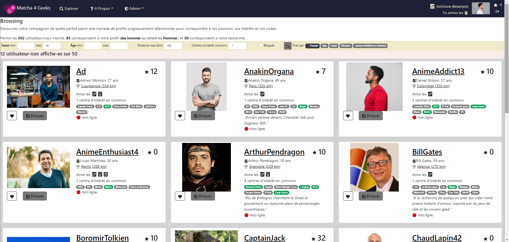

# Matcha - École 42 - par dFleury

`Because, love too can be industrialized.`

## Description

Ce project de la branche Web de l'École 42 est une application de rencontres qui vous permet de rechercher, de liker et de discuter avec d'autres utilisateurs.

## Fonctionnalités

- **Authentification sécurisée**: Utilisation du token JWT pour sécuriser l'accès à l'application.
- **Profil utilisateur personnalisé**: Créez et personnalisez votre profil avec des informations telles que vos centres d'intérêt, photos, etc.
- **Recherche de profils**: Trouvez des utilisateurs en fonction de différents critères tels que la localisation, les centres d'intérêt, etc.
- **Matching**: Likez les profils qui vous intéressent et découvrez les correspondances mutuelles.
- **Chat en temps réel**: Communiquez avec vos matchs grâce à un système de chat en temps réel intégré.
- **Géolocalisation**: Affichez la distance entre les utilisateurs pour faciliter les rencontres en personne.

## Technologies Utilisées

- **Frontend**: React.js, Bootstrap
- **Backend**: Express.js
- **Base de données**: MySQL, MongoDB (ou toute autre base de données de votre choix)
- **Authentification**: JWT (JSON Web Tokens)
- **Géolocalisation**: API de géolocalisation (intégration facultative)

## Utilisation

- Clonez le projet.
- Créez les fichiers `.env` dans les dossiers `/front` et `/back`

  (copiez les fichiers `.env.exemple` et modifiez les variables necessaires)

- Executez la commande `make` à la racine du projet.

- Rendez-vous à l'adresse `http://localhost:3009`

- Si vous essayez l'adresse du backend ( `http://localhost:3008` ) dans le navigateur, vous aurez le message `forbidden`

### Fixtures

- Les tables de la BDD et des fixtures sont crées avec le fichier `/pgsql/CreateDB.sql`

- Sur le front, rendez-vous dans `Admin` (saisissez le superPassword du fichier `/back/.env`) et cliquez sur les boutons `create fixtures`

---

&nbsp;

&nbsp;

## Instructions

  

    <code>Instructions Générales</code>
  

- Vous êtes libre d'utiliser n'importe quel **langage de programmation, micro-framework et bibliothèque** d'interface utilisateur.
  Un "micro-framework" inclut un routeur et éventuellement un moteur de modèle, mais n'inclut pas un ORM, des validateurs, ou un gestionnaire de compte utilisateur.

- Vous devez utiliser une **base de données** gratuite (MySQL, MariaDB, PostgreSQL, Cassandra, InfluxDB, Neo4j, etc.) et vous devrez créer vos requêtes manuellement. (Vous pouvez cependant créer votre propre bibliothèque pour simplifier vos requêtes.)

- Vous êtes libre de choisir le **serveur web** qui convient le mieux à vos besoins (Apache, Nginx ou un serveur web intégré).

- Votre site web doit avoir une **mise en page** décente : au moins un en-tête, une section principale et un pied de page.

- Votre site web doit être utilisable sur un **téléphone portable** et conserver une mise en page acceptable sur de petites résolutions.

- Tous vos formulaires doivent avoir une validation appropriée et l'ensemble du site web doit être sécurisé.
  Il s'agit d'une partie obligatoire et sera examinée en détail lors de la défense.

- Pour vous donner une idée, voici quelques éléments considérés comme non sécurisés :

  - Stocker des mots de passe en texte clair dans votre base de données.
  - Autoriser l'injection de code HTML ou JavaScript utilisateur dans des variables non protégées.
  - Autoriser le téléchargement de contenu indésirable.
  - Autoriser la modification des requêtes SQL.

- Pour des raisons de sécurité évidentes, toutes les informations d'identification, clés API, variables d'environnement, etc., doivent être stockées localement dans un fichier .env et exclues de git. Stocker les informations d'identification publiquement peut entraîner l'échec du projet.

---

  

    <code>Inscription et Connexion</code>
  

- L'application doit permettre à un utilisateur de s'**inscrire** en demandant au moins son adresse e-mail, nom d'utilisateur, nom de famille, prénom et un mot de passe protégé d'une manière ou d'une autre.

- Après l'inscription, un e-mail contenant un lien unique doit être envoyé à l'utilisateur pour **vérifier son compte**.

- L'utilisateur doit pouvoir **se connecter** en utilisant son nom d'utilisateur et son mot de passe.

- L'utilisateur doit pouvoir recevoir un e-mail lui permettant de **réinitialiser son mot de passe** s'il l'oublie.

- L'utilisateur doit pouvoir **se déconnecter** avec **un seul clic** depuis n'importe quelle page du site.

---

  

    <code>Profil Utilisateur</code>
  

- Une fois qu'un utilisateur est connecté, il doit **remplir son profil** en fournissant les informations suivantes :

  - Le genre.
  - Les préférences sexuelles.
  - Une biographie.
  - Une liste d'intérêts avec des tags (par exemple, #vegan, #geek, #piercing, etc.), qui doivent être réutilisables.
  - Jusqu'à 5 photos, dont une à utiliser comme photo de profil.

- À tout moment, l'utilisateur doit pouvoir **modifier ces informations**, ainsi que son nom de famille, prénom et adresse e-mail.

  - {{{Si modification email => renvoyer mail de confirmation}}}

- L'utilisateur doit pouvoir vérifier **qui a consulté son profil**,

- L'utilisateur doit pouvoir vérifier **qui les a "likés"**.

- L'utilisateur doit avoir une "**cote de popularité**" (fame rating) publique. (À vous de définir ce que signifie "cote de popularité" tant que vos critères sont cohérents.)

- L'utilisateur doit être **localisé** à l'aide de la géolocalisation GPS, jusqu'à son quartier. Si
  l'utilisateur ne souhaite pas être localisé, vous devez trouver un moyen de les localiser même
  sans leur consentement (Oui, c'est ce que font les sites de rencontres...). L'utilisateur doit pouvoir modifier sa position GPS dans
  son profil.

---

  

    <code>Navigation/Exploration (Browsing)</code>
  

- L'utilisateur doit pouvoir obtenir facilement une **liste de suggestions qui correspondent à son profil**.

- Vous ne proposerez que des profils "intéressants". Par exemple, seuls des hommes pour une femme hétérosexuelle.
  Vous devez gérer la bisexualité.

- ~~Si l'orientation de l'utilisateur n'est pas spécifiée, elle sera considérée comme bisexuelle.~~ {{{Dans mon projet, l'utilisateur doit indiquer ses préférences sexuelles a l'inscription !}}}

- Vous devez intelligemment faire correspondre (Pondération d'au moins plusieurs critères.) en fonction de :

  - La même zone géographique que l'utilisateur.
  - Un maximum de tags communs.
  - Un maximum de "cote de popularité".

- Vous devez privilégier l'affichage de personnes de la même zone géographique.

- La liste doit être triable par âge, emplacement, "cote de popularité" et tags communs.

- La liste doit être filtrable par âge, emplacement, "cote de popularité" et tags communs.

---

  

    <code>Recherche</code>
  

- L'utilisateur doit pouvoir effectuer une **recherche avancée** en sélectionnant un ou plusieurs **critères**, tels que :

  - Une plage d'âge.
  - Une différence de "cote de popularité".
  - Une localisation.
  - Un ou plusieurs tags d'intérêt.

- Pour la liste suggérée, la liste résultante doit être **triable** et **filtrable** par âge, emplacement, "cote de popularité" et tags.

---

  

    <code>Profil des autres utilisateurs</code>
  

- Un utilisateur doit pouvoir **consulter les profils d'autres utilisateurs**.

- Les profils doivent contenir toutes les informations disponibles les concernant, à l'exception de l'adresse e-mail et du mot de passe.

- Lorsqu'un utilisateur consulte un profil, celui-ci doit être ajouté à son **historique de visites**.

- Un utilisateur doit pouvoir :

  - manifester de l'intérêt pour d'autres utilisateurs avec un "**like**" (trouver un mot plus explicite pour cette action),
  - "Liker" la photo de profil d'un autre utilisateur. Lorsque deux personnes se "likent" mutuellement, elles seront considérées comme "connectées" et pourront commencer à discuter. Si l'utilisateur actuel n'a pas de photo de profil, il ne peut pas effectuer cette action.
  - Vous devez également retirer votre "like" à un utilisateur que vous aviez précédemment "liké". L'utilisateur ne générera plus de notifications, et vous ne pourrez plus discuter avec lui.
  - Vérifier la "**cote de popularité**" d'un autre utilisateur.
  - Voir si un utilisateur est actuellement **en ligne**, et sinon, voir la date et l'heure de **sa dernière connexion**.
  - Signaler un utilisateur comme un **"compte fake"**.
  - **Bloquer un utilisateur**.
    - Un utilisateur bloqué ne figurera plus dans les résultats de recherche
    - Un utilisateur bloqué ne générera pas de notifications supplémentaires.
    - Il ne sera plus possible de discuter avec un utilisateur bloqué.

- Un utilisateur doit pouvoir voir clairement si le profil qu'il consulte est connecté ou a "liké" son profil, et doit être en mesure de "unliker" ou se déconnecter de ce profil.

---

  

    <code>Chat</code>
  

- Lorsque deux utilisateurs sont connectés (ce qui signifie qu'ils se sont "aimés" mutuellement), ils doivent pouvoir "discuter" en temps réel (avec un délai maximal de 10 secondes).
- L'utilisateur doit être en mesure de voir depuis n'importe quelle page s'il a reçu un nouveau message.

---

  

    <code>Notifications</code>
  

- Un utilisateur doit être notifié en temps réel (avec un délai maximal de 10 secondes) des événements suivants :

  - Lorsque le profil de l'utilisateur a été consulté.
  - Lorsque l'utilisateur reçoit un message.
  - Lorsque l'utilisateur reçoit un "like".
  - Lorsque l'utilisateur "liké" like également l'utilisateur en retour.
  - Lorsqu'un utilisateur connecté "annule son like" sur l'utilisateur.

- Un utilisateur doit être en mesure de voir, depuis n'importe quelle page, qu'une notification n'a pas été lue.

{{{ dans **Profil des autres utilisateurs**: "Voir si un utilisateur est actuellement en ligne": ca ne veut pas dire qu'on doit envoyer une notif de connexion}}}

---

  

    <code>Partie Bonus</code>
  

- Bonus possibles que vous pouvez implémenter pour obtenir des points supplémentaires.

  - Ajouter des stratégies **Omniauth** pour l'authentification des utilisateurs.
  - Autoriser l'**importation d'images depuis des réseaux sociaux** (Snapchat, Facebook, Google+, etc.).
  - Développer une **carte interactive** des utilisateurs, nécessitant une localisation GPS plus précise via JavaScript.
  - Intégration d'un **chat vidéo ou audio** pour les utilisateurs connectés.
  - Implémentation d'une fonctionnalité pour **planifier et organiser des rencontres ou des événements** réels pour les utilisateurs correspondants.

---

